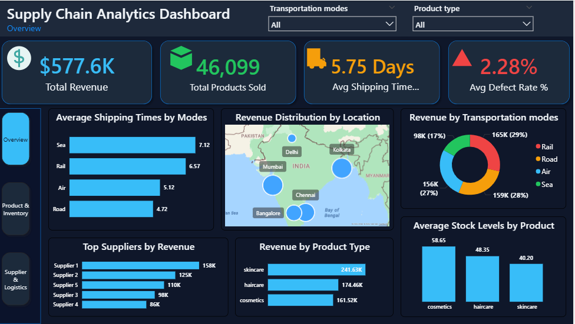

# 📊 Supply Chain Analytics Dashboard (SQL + Power BI)

## 🚀 Project Overview

This project delivers an end-to-end Supply Chain Analytics solution using SQL and Power BI. It focuses on analyzing product performance, supplier efficiency, and logistics operations to support data-driven decision-making.

The dashboard is designed with a modern dark theme and interactive visuals, enabling stakeholders to monitor key performance metrics and identify operational risks.

---

## 🎯 Business Objectives

The goal of this project is to answer critical supply chain questions:

* Which products generate the highest demand and revenue?
* Are inventory levels aligned with product demand?
* Which suppliers are efficient and which pose risks?
* What are the trade-offs between shipping cost and delivery time?
* Which transportation modes are cost-effective and reliable?

---

## 🛠️ Tools & Technologies

* **Power BI** → Data visualization & dashboard development
* **MySQL** → Data querying & transformation
* **DAX** → Measures and calculations
* **Power Query** → Data cleaning and preprocessing

---

## 🔄 Project Workflow

### 1️⃣ Data Collection

* Imported supply chain dataset containing product, supplier, and logistics data
* Key fields include revenue, shipping cost, lead time, stock levels, and defect rates

---

### 2️⃣ Data Cleaning (Power Query)

* Handled missing values and inconsistencies
* Standardized column names
* Ensured correct data types (numeric, categorical)
* Prepared dataset for analysis

---

### 3️⃣ SQL Analysis

* Created structured queries to analyze:

  * Product performance
  * Supplier contribution
  * Logistics metrics
* Generated aggregated datasets for Power BI

---

### 4️⃣ Data Modeling (Power BI)

* Built a clean data model
* Created relationships between tables
* Developed calculated measures using DAX:

  * Total Revenue
  * Avg Shipping Time
  * Avg Lead Time
  * Defect Rate %

---

### 5️⃣ Dashboard Development

#### 📍 Page 1 — Executive Overview

* KPI Cards (Revenue, Products Sold, Shipping Time, Defect Rate)
* Revenue distribution by product and region
* Transportation mode analysis
* High-level business insights

---

#### 📍 Page 2 — Product & Inventory Analysis

* Product Demand vs Inventory (Combo Chart)
* Product Revenue vs Sales Volume (Scatter Plot)
* Defect Rate Heatmap (Matrix)
* Product Performance Summary Table

---

#### 📍 Page 3 — Supplier & Logistics Performance

* Supplier Cost vs Delivery Efficiency (Scatter Plot)
* Shipping Cost Contribution (Waterfall Chart)
* Delivery Time by Transport Mode
* Supplier Risk Analysis Table

---

## 📊 Key Insights

* Skincare products drive the highest revenue and demand
* Inventory levels are not evenly aligned across product categories
* Some suppliers show higher defect rates and lead times, indicating operational risk
* Transportation modes present trade-offs between cost and delivery speed

---

## 📸 Dashboard Preview

### 🔹 Executive Overview



### 🔹 Product & Inventory Analysis


### 🔹 Supplier & Logistics Performance


---

## 💡 Business Impact

This dashboard enables organizations to:

* Optimize supplier selection
* Reduce logistics costs
* Improve delivery performance
* Identify high-risk suppliers
* Align inventory with demand

---

## 📁 Project Structure

```
supply-chain-analytics-dashboard
│
├── dataset
├── sql
├── powerbi
├── screenshots
└── README.md
```

---

## 👨‍💻 About Me

Hi, I’m Ajay — a freelance Data Analyst specializing in Power BI, SQL, and Excel.
I build interactive dashboards and data-driven solutions for businesses.

🔗 LinkedIn: https://www.linkedin.com/in/ajay-kumar-56a853398
🔗 GitHub: https://github.com/ajay-data-analyst

---

## ⭐ If you like this project

Give it a ⭐ on GitHub and feel free to connect with me!

